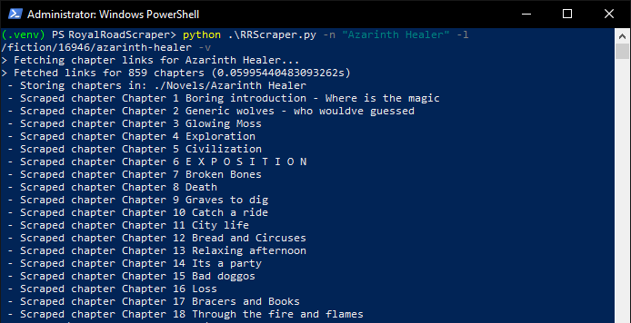
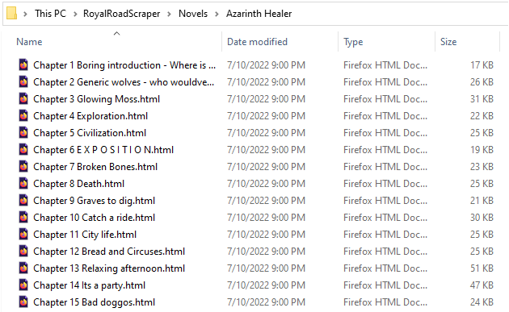

# RoyalRoadScraper
A simple scraper with basic HTML handling for the novel-publishing site RoyalRoad.

This software came to be after I had a long flight with no Wi-Fi a couple weeks back, and found myself wishing I had a couple chapters stored.

# Setup & Usage:

## Setup:
This is a simple Python script - as such, it can either be run from ta command-line interface, IDE or Python interpreter. (One can also build it into an executable if desired).

The software relies on a small set of Python libraries. It is advised to set up a Python virtual environment to contain this project as to avoid any potential conflicts with global installations.

After forking the repository, the following command can be executed within the project directory for creating a local virtual environment.
```powershell
> python -m venv .venv
```

Once the virtual environment is created, one should activate it, and install the required Python libraries.
```powershell
> .venv/Scripts/Activate.ps1
> python -m pip install -r requirements.txt
```

## Usage:
Once everything is set up and the dependancies installed, one can run the program from within the virtual environemnt by simply executing the main script, *RRScraper.py*. A glance at the help menu from a *PowerShell* powershell:
```powershell
(.venv) PS X:\RoyalRoadScraper> python .\RRScraper.py --help
usage: RRScraper.py [-h] -n NAME -l LINK [-o OUT] [-v]

Scrape Novels from RoyalRoad.
optional arguments:
  -h, --help            show this help message and exit

Required Arguments:
  -n NAME, --name NAME  Novel's name
  -l LINK, --link LINK  Link to the novel's index

Optional Arguments:
  -o OUT, --out OUT     Output directory
  -v, --verbose         Execute in verbose mode
```

Some command examples following the format specified above:

```powershell
> RRScraper.py -n "Novel Name" -l /fiction/123/novelname
> RRScraper.py --name "Novel Name" --link /fiction/123/novelname --out Folder
> RRScraper.py -n "Novel Name" -l https://www.royalroad.com/fiction/123/novel-name -v
> RRScraper.py -n "Novel Name" -l https://www.royalroad.com/fiction/123/novel-name -o Folder - v
```


If run with the *verbose* argument, the program will output status updates as it executes: 


You should then have a folder created within the Novels/[Output] subdirectory with the the scraped chapters.


# Notes

The scraper enforces a 1 second delay inbetween each chapter download. This is to not spam the RoyalRoad servers. One can reduce (or even remove) this delay if desired within the sourcecode, but I would strongly encourage you not to.

The scraper does not currently support chapter numbers or range specifications. This feature might be introduced in future updates, although the chapter numbering is not always straightforward given that authors release polls/announcements/other non-content chapters.

The stored chapters are saved as HTML files, and make use of a very simple CSS file which can be found under *Templates/ChapterCSS.css*. Feel free to tweak said file to customize you reading experience.

Remember to support [RoyalRoad](https://www.royalroad.com/home "RoyalRoad") and its authors, as well as to be polite when saving chapters for offline reading.